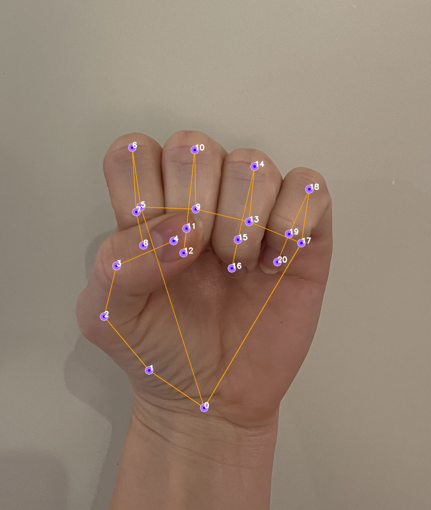
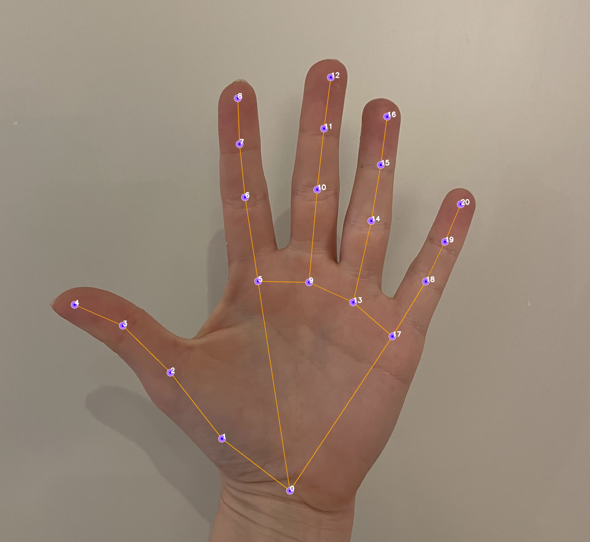
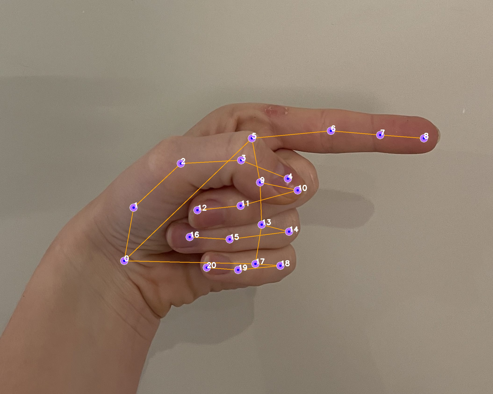
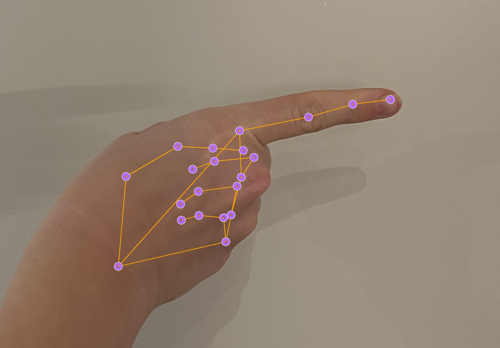
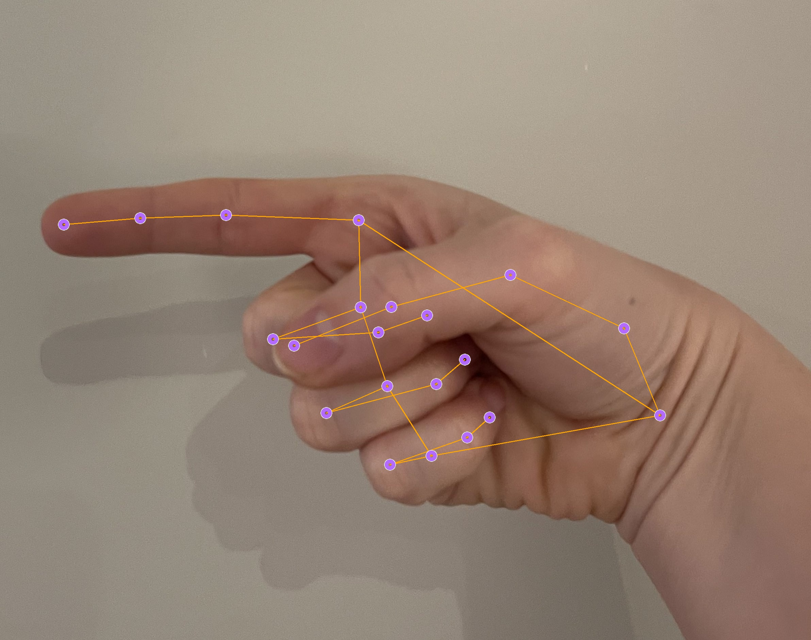
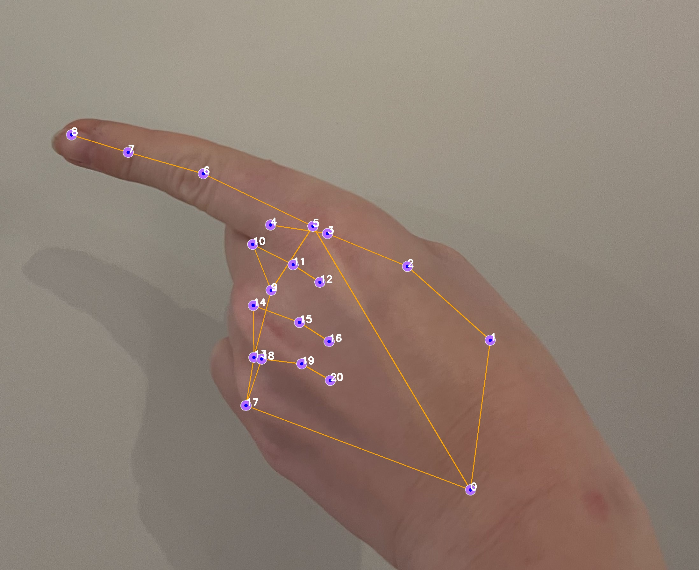
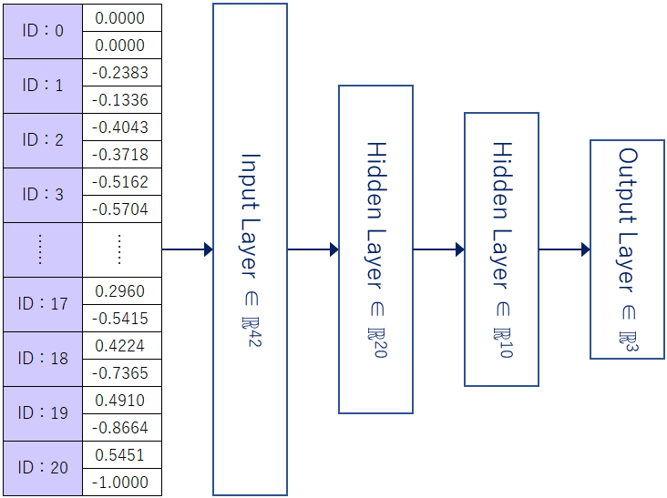
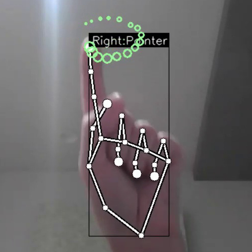
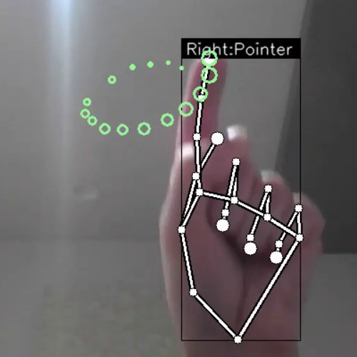

# CompVision-MapNavigator
The purpose of the project is to build a program which will take some hand gestures to navigate in a computer. For the sake of the example we will use it to neviagte through Google Maps.
We chose to go forward with two different models to see the differences between them

Before starting either, remember to initialize your virtual environment and run `pip install requirements.txt`

 ### 1. **Media Pipe model**
  - To run this one `python3 app.py`
  - [Jump to guide](#mediapipe-model)

    
### 2. **Keras model**
  - To run the keras model `python3 keras_app.py`
  - [Jump to guide](#keras-model)
    
**Hand Gestures vary for each model**

# MediaPipe Model

## Introduction

The MediaPipe Hands model provides a high-fidelity approach to hand tracking and gesture recognition. Utilizing advanced machine learning techniques, it delivers real-time performance across a variety of devices and platforms.

## Architecture
The architecture of the MediaPipe Hands model comprises several key components:

- **Hand Detection Model:** Initially identifies a hand in the image frame using a palm detection algorithm, ensuring accurate recognition even when the hand is partially visible or in motion.
- **Landmark Model:** Once a hand is detected, the model employs a separate neural network to predict 21 3D hand landmarks. These landmarks correspond to distinct points on the hand, such as fingertips and joints.
- **Tracking Mechanism:** Utilizes an online tracking system that maintains the identity of each hand, facilitating smooth and consistent landmark detection over time.
  
## Hand Gestures Guide

<table>
  <tr>
    <td>
      
    </td>
    <td>
      <b>Closed Palm</b> will simulate a left mouse click, and hold it down as long as the palm is closed.
    </td>
  </tr>
  <tr>
    <td>
      
    </td>
    <td>
      <b>Open Palm</b> will move the cursor.
    </td>
  </tr>
  <tr>
    <td>
      
      
    </td>
    <td>
      <b>Pointing Right</b> will simulate scrolling in or zooming in.
    </td>
  </tr>
  <tr>
    <td>
      
      
    </td>
    <td>
      <b>Pointing Left</b> will simulate scrolling out or zooming out.
    </td>
  </tr>
</table>

## Logic

The logic is mostly in the file calles "hand_gestures"

<table>
    <tr>
        <th>Method Name</th>
        <th>Parameters</th>
        <th>Returns</th>
        <th>Logic</th>
    </tr>
    <tr>
        <td>is_palm_open</td>
        <td>hand_landmarks (list)</td>
        <td>bool</td>
        <td>Checks if the tips of all fingers are above their respective joints (excluding the thumb).</td>
    </tr>
    <tr>
        <td>is_palm_closed</td>
        <td>hand_landmarks (list)</td>
        <td>bool</td>
        <td>Checks if the tips of all fingers are below their respective joints (excluding the thumb).</td>
    </tr>
    <tr>
        <td>is_pointing</td>
        <td>hand_landmarks (list)</td>
        <td>tuple (bool, direction)</td>
        <td>Checks if the hand is pointing and determines the direction based on the index finger's position and orientation.</td>
    </tr>
    <tr>
        <td>is_dragging</td>
        <td>hand_landmarks (list), previous_hand_landmarks (list)</td>
        <td>bool</td>
        <td>Compares the current and previous positions to determine if the hand is moving while closed.</td>
    </tr>
    <tr>
        <td>get_position</td>
        <td>hand_landmarks (list)</td>
        <td>tuple (avg_x, avg_y)</td>
        <td>Calculates the average position of all hand landmarks to find the center of the hand.</td>
    </tr>
    <tr>
        <td>process_image</td>
        <td>image</td>
        <td>list</td>
        <td>Processes an image for hand detection by converting color and flipping the image for hand landmarks detection.</td>
    </tr>
</table>

## Demo

# Keras Model

## Introduction
The Keras model is built off of an LSTM network, trained on a dataset of hand gestures. The model is able to recognize 4 different hand gestures, and uses them to navigate through Google Maps. The model is trained on a dataset of 20 key poinnts on the hand and then classifies the hand gesture based on the position of these points. Our mediapipe model simply classifies the hand gestures based on the position of the hand landmarks and weather or not certain points are in place in comparison to the others. The Keras model is able to recognize the following hand gestures:
- Open
- Closed
- Pointer (Clockwise movement)
- Pointer (Counter-clockwise movement)

As can be seen above, the input of the model is a sequence of 20 key points, and the output is a classification of the hand gesture. The model is trained on a dataset of 4 different hand gestures, and is able to recognize them with a high degree of accuracy (roughly 97%), which is significantly higher than simply using media pipe. Aditionally this model can be retrained using new hand gestures when running the original repository, providing a high degree of flexibility.

## Architecture and Logic

The model sets up queues (deque) for storing recent points and finger gestures, allowing the system to consider temporal information (i.e., sequences of gestures over time). Then when the main loop is initalised it converts the captured image to RGB and uses the HandGestureRecognition model to detect and track hands in the image. For each detected hand, it extracts landmarks (key points), processes them, and tracks the tip of the index finger for movement gestures, depending on if it is in a pointer position.

Key Point Classification: Classifies the current hand posture based on the processed landmarks, identifying gestures like pointing.
Point History Classification: If the history of point movements is sufficient, it attempts to classify the movement pattern (e.g., dragging, clockwise rotation). Depending on the recognized gestures and movements, it performs actions navigates the map acoordingly (see below for guide). Visual feedback is provided by drawing landmarks and gesture names on the captured image, which is then displayed in a window.

The keypoint and point history models are called once per frame for each hand detected. The frequency of these calls depends on the frame rate of the camera and the processing speed of the computer. Typically, this would be in the range of 15 to 60 times per second. Hand tracking and gesture recognition are also performed in real-time for each frame. The actual rate depends on the aforementioned factors but aims to be as real-time as possible to allow fluid interaction.

Actions based on recognized gestures are executed as soon as a gesture is identified and classified, allowing for immediate response to user input.

## Hand Gestures Guide

<table>
  <tr>
    <td>
      
    </td>
    <td>
      <b>Closed Palm</b> will simulate a left mouse click, and hold it down as long as the palm is closed, allosing usors to move around the map.
    </td>
  </tr>
  <tr>
    <td>
      
    </td>
    <td>
      <b>Open Palm</b> will move the cursor.
    </td>
  </tr>
  <tr>
    <td>
      
    </td>
    <td>
      <b>Pointing Up and moving finger clockwise</b> will simulate scrolling to the right or zooming in.
    </td>
  </tr>
  <tr>
    <td>
      
    </td>
    <td>
      <b>Pointing Up and moving finger counter clockwise</b> will simulate scrolling to the left or zooming out.
    </td>
  </tr>
</table>

## Demo

Insert demo video here

# Comparing the models

## MediaPipe Model
**Real-Time Tracking and Recognition**: MediaPipe Hands utilizes a sophisticated pipeline that combines hand detection and landmark tracking. It identifies 21 3D hand landmarks in real-time, making it exceptionally suited for interactive applications. This capability stems from its optimized ML algorithms designed to run efficiently on a variety of hardware, ensuring smooth user experience across devices.

**Robustness Across Conditions**: The MediaPipe model is engineered to handle diverse scenarios, including varying lighting conditions, hand sizes, and complex background movements. Its hand detection model initially locates the hand within the frame, followed by the landmark model that accurately predicts hand posture. This two-step process helps maintain consistent tracking even when the hand is partially obscured or moving rapidly.

**Implementation Complexity and Overhead**: Implementing MediaPipe involves integrating a pre-built framework that abstracts much of the complexity involved in hand tracking and gesture recognition. However, this convenience comes at the cost of reduced flexibility in customizing the model or extending it to recognize new, user-defined gestures without significant alterations to the framework.

## Keras Model
**Custom Gesture Recognition**: The Keras model, built on an LSTM network, excels in recognizing a predefined set of gestures with high accuracy. The LSTM architecture allows the model to learn from temporal sequences of hand movements, providing it with the context needed to distinguish between complex gestures. This aspect is particularly beneficial for applications requiring precise gesture classification, such as distinguishing between subtly different navigation commands.

**Adaptability and Extensibility**: A significant advantage of the Keras model is its adaptability. Since it is trained directly on a dataset of hand gestures, introducing new gestures or refining the recognition of existing ones can be achieved by retraining the model with augmented data. This flexibility makes the Keras model a more suitable choice for applications where the set of gestures might evolve over time or needs to be customized for specific user groups.

**Latency and Performance Considerations**: While the LSTM-based Keras model can achieve high accuracy, its performance is contingent on the computational resources available, particularly for real-time applications. Processing sequences of hand landmarks to classify gestures might introduce latency, especially on lower-end devices or when handling high-resolution video feeds. This trade-off between accuracy and speed needs to be carefully balanced, depending on the application's requirements.

## Conclusion
The choice between MediaPipe and Keras models hinges on the specific needs of the hand gesture recognition system being developed. MediaPipe offers robust, real-time hand tracking and a general-purpose solution that works out of the box for a wide range of applications. In contrast, the Keras model provides high accuracy in gesture recognition, adaptability, and the ability to customize gesture sets at the cost of potentially higher latency and the need for a more involved development process to train and fine-tune the model. Analyzing the application's specific requirements, such as the need for real-time interaction, the complexity of gestures, and the computational resources available, will guide the selection of the most appropriate model.
