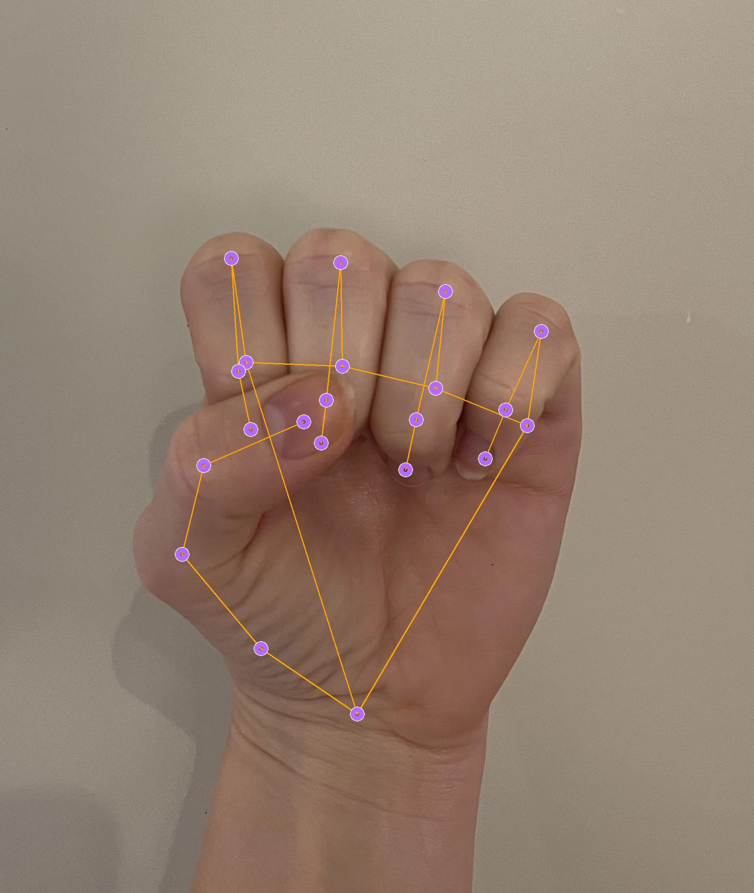
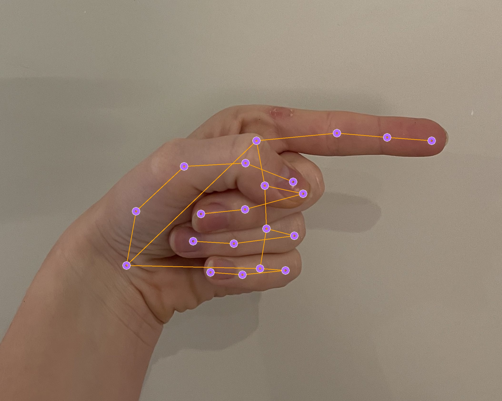

# CompVision-MapNavigator
The purpose of the project is to build a program which will take some hand gestures to navigate in a computer. For the sake of the example we will use it to neviagte through Google Maps.
We chose to go forward with two different models to see the differences between them

Before starting either, remember to initialize your virtual environment and run `pip install requirements.txt`

 ### 1. **Media Pipe model**
  - To run this one `python3 app.py`
  - [Jump to guide](#mediapipe-model)

    
### 2. **Keras model**
  - To run the keras model `python3 keras_app.py`
  - Guide
    
**Hand Gestures vary for each model**

# MediaPipe Model

## Introduction

The MediaPipe Hands model provides a high-fidelity approach to hand tracking and gesture recognition. Utilizing advanced machine learning techniques, it delivers real-time performance across a variety of devices and platforms.

## Architecture
The architecture of the MediaPipe Hands model comprises several key components:

- **Hand Detection Model:** Initially identifies a hand in the image frame using a palm detection algorithm, ensuring accurate recognition even when the hand is partially visible or in motion.
- **Landmark Model:** Once a hand is detected, the model employs a separate neural network to predict 21 3D hand landmarks. These landmarks correspond to distinct points on the hand, such as fingertips and joints.
- **Tracking Mechanism:** Utilizes an online tracking system that maintains the identity of each hand, facilitating smooth and consistent landmark detection over time.
  
## Hand Gestures Guide

<table>
  <tr>
    <td>
      
    </td>
    <td>
      <b>Closed Palm</b> will simulate a left mouse click, and hold it down as long as the palm is closed.
    </td>
  </tr>
  <tr>
    <td>
      
    </td>
    <td>
      <b>Open Palm</b> will move the cursor.
    </td>
  </tr>
  <tr>
    <td>
      
      
    </td>
    <td>
      <b>Pointing Right</b> will simulate scrolling to the right or zooming in.
    </td>
  </tr>
  <tr>
    <td>
      
      
    </td>
    <td>
      <b>Pointing Left</b> will simulate scrolling to the left or zooming out.
    </td>
  </tr>
</table>

## Logic

The logic is mostly in the file calles "hand_gestures"

<table>
    <tr>
        <th>Method Name</th>
        <th>Parameters</th>
        <th>Returns</th>
        <th>Logic</th>
    </tr>
    <tr>
        <td>is_palm_open</td>
        <td>hand_landmarks (list)</td>
        <td>bool</td>
        <td>Checks if the tips of all fingers are above their respective joints (excluding the thumb).</td>
    </tr>
    <tr>
        <td>is_palm_closed</td>
        <td>hand_landmarks (list)</td>
        <td>bool</td>
        <td>Checks if the tips of all fingers are below their respective joints (excluding the thumb).</td>
    </tr>
    <tr>
        <td>is_pointing</td>
        <td>hand_landmarks (list)</td>
        <td>tuple (bool, direction)</td>
        <td>Checks if the hand is pointing and determines the direction based on the index finger's position and orientation.</td>
    </tr>
    <tr>
        <td>is_dragging</td>
        <td>hand_landmarks (list), previous_hand_landmarks (list)</td>
        <td>bool</td>
        <td>Compares the current and previous positions to determine if the hand is moving while closed.</td>
    </tr>
    <tr>
        <td>get_position</td>
        <td>hand_landmarks (list)</td>
        <td>tuple (avg_x, avg_y)</td>
        <td>Calculates the average position of all hand landmarks to find the center of the hand.</td>
    </tr>
    <tr>
        <td>process_image</td>
        <td>image</td>
        <td>list</td>
        <td>Processes an image for hand detection by converting color and flipping the image for hand landmarks detection.</td>
    </tr>
</table>

## Demo

# Keras Model

## Architecture

## Hand Gestures Guide

## Logic

## Demo

# Comparing the models

